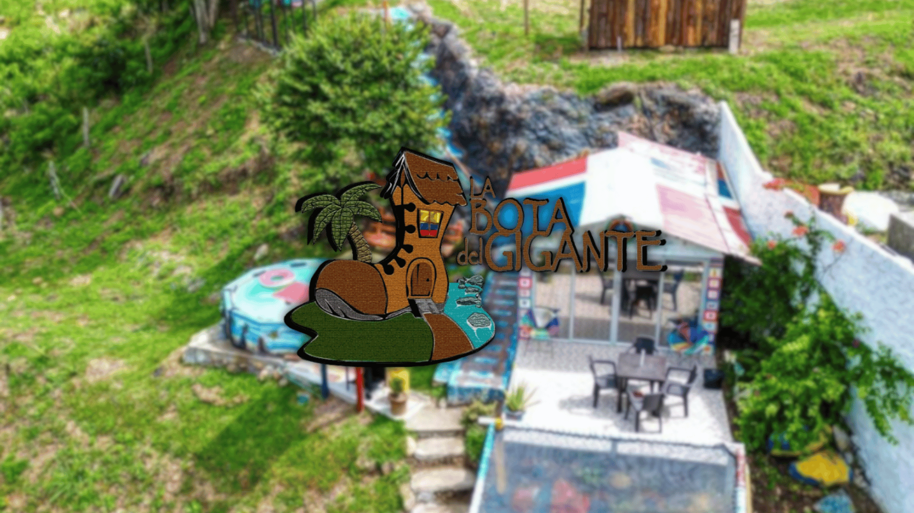

<p align="center">
  
</p>

# La Bota del Gigante


 La Bota del Gigante es un aplicativo web desarrollado en Laravel, bootstrap, ccs nativo y MySQL.Hemos creado una aplicación web moderna e intuitiva para ofrecer a nuestros clientes una experiencia fluida y simplificada al reservar habitaciones y acceder a nuestros servicios.
El proyecto fue concebido para optimizar el proceso de reservas y mejorar la eficiencia operativa de nuestro hotel, brindando a los clientes la comodidad de planificar su estancia desde cualquier lugar y en cualquier momento. En esta página, te mostraremos cómo hemos diseñado, desarrollado e implementado nuestra aplicación web, con un enfoque en la funcionalidad, la usabilidad y la escalabilidad.


## Descripción del Proyecto

Explora y descubre cómo nuestra solución digital te permite gestionar tus reservas fácilmente y disfrutar de una experiencia de usuario excepcional. Desde el inicio, nuestra prioridad fue crear un sistema de reservaciones eficiente y amigable para nuestros huéspedes. ¡Bienvenido a una nueva era en "La Bota del Gigante"!

## Tecnologías Utilizadas

- **Laravel**: Framework PHP para el desarrollo de aplicaciones web.
- **BootstrapCSS**: Framework CSS para un diseño rápido y personalizable.
- **MySQL**: Sistema de gestión de bases de datos relacional.

## Instalación

Sigue estos pasos para configurar el proyecto en tu entorno local:

1. Clona el repositorio:
   ```bash
   git clone https://github.com/
   cd BOTADELGIGANTE_0002
   ```

2. Instala las dependencias de PHP y JavaScript:
   ```bash
   composer install
   npm install
   ```

3. Configura el archivo `.env`:
   ```bash
   cp .env.example .env
   php artisan key:generate
   ```

4. Configura la base de datos en el archivo `.env`:
   ```env
   DB_CONNECTION=mysql
   DB_HOST=127.0.0.1
   DB_PORT=3306
   DB_DATABASE=botagigante
   DB_USERNAME=tu_usuario
   DB_PASSWORD=tu_contraseña
   ```

5. Ejecuta las migraciones y los seeders:
   ```bash
   php artisan migrate --seed
   ```

6. Inicia el servidor de desarrollo:
   ```bash
   php artisan serve
   npm run dev
   ```

## Uso

Accede a la aplicación en tu navegador a través de `http://localhost:8000/`. Desde allí, podrás gestionar toda la informacion del aplicativo dandote una amplia rama de opciones para editar, eliminar, agregar y actualizar toda la informacion existente.

## Contribuidores

El proyecto fue desarrollado por la aprendiz **Katerin Giseth Maecha Muñoz**, bajo la supervisión del instructor **Héctor David Toledo García**.

## Licencia

Este proyecto está licenciado bajo la Licencia MIT. Consulta el archivo [LICENSE](LICENSE) para más detalles.

---

¡Gracias por utilizar La Bota del Gigante! Si tienes alguna pregunta o sugerencia, no dudes en contactarnos.
